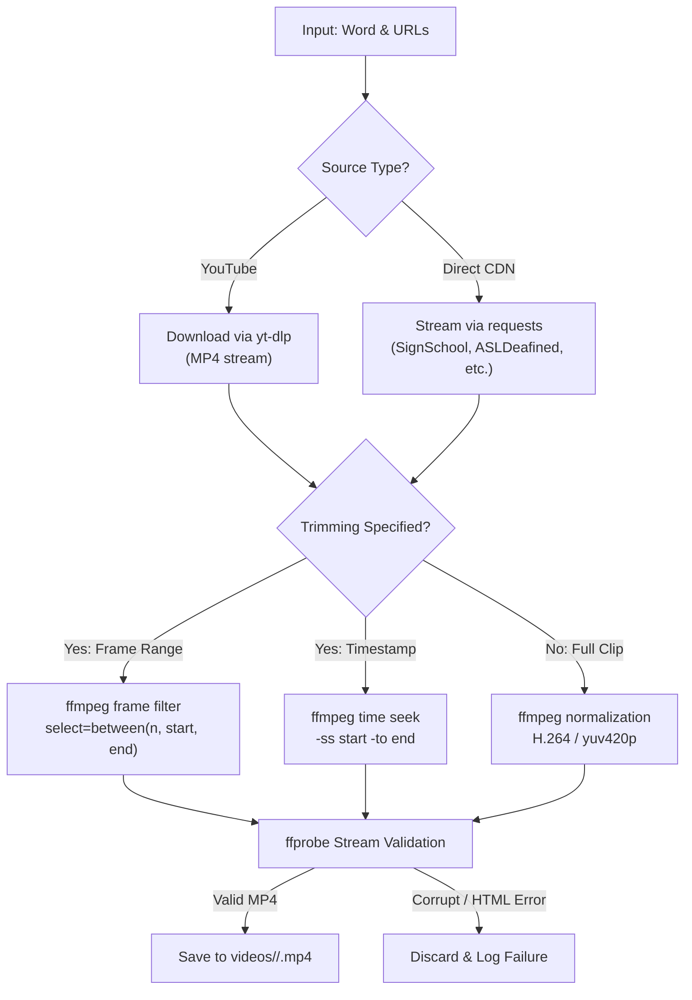

# Sign Language Video Downloader & Live Studio

A complete, robust toolkit for downloading, trimming, validating, and organizing sign language videos into per-word directories. Built for both the **WLASL (Word-Level American Sign Language)** dataset and **custom user-provided video links**.

---

## Table of Contents

- [Overview](#overview)
- [Prerequisites & Requirements](#prerequisites--requirements)
- [Repository Structure](#repository-structure)
- [Method 1: Interactive Live Web UI Studio](#method-1-interactive-live-web-ui-studio)
  - [Launching the Web UI](#launching-the-web-ui)
  - [Card-Based Copy-Paste Input](#card-based-copy-paste-input)
  - [Bulk Text & File Upload](#bulk-text--file-upload)
  - [Live Monitoring & Built-in Player](#live-monitoring--built-in-player)
- [Method 2: Command-Line Interface (CLI)](#method-2-command-line-interface-cli)
  - [Default Curated Words](#default-curated-words)
  - [Custom Words via CLI](#custom-words-via-cli)
  - [CLI Flags & Options](#cli-flags--options)
- [Supported Input Formats & Syntax](#supported-input-formats--syntax)
- [How It Works Under the Hood](#how-it-works-under-the-hood)
- [Pre-Downloaded Curated Words (77 Videos)](#pre-downloaded-curated-words-77-videos)
- [Troubleshooting & FAQs](#troubleshooting--faqs)

---

## Overview

Sign language datasets like WLASL span multiple video sources (YouTube, SignSchool, ASLDeafined, ASLBricks, SpreadTheSign, etc.). Many online videos disappear over time, and YouTube videos often contain full dictionaries requiring frame-level extraction to isolate a specific sign.

This repository provides two complementary pipelines:
1. **Automated CLI Pipeline**: Scans the WLASL dataset index, automatically downloads videos for specified words, extracts exact sign frame ranges, handles broken links gracefully, and generates audit reports.
2. **Interactive Live Web UI Studio**: Allows users to dynamically add words, paste lists of arbitrary links, upload batch files, watch download progress in real time via Server-Sent Events (SSE), and preview downloaded sign clips directly in the browser.

All downloaded videos are standardized as **H.264 MP4**, verified with `ffprobe`, and organized into separate word directories under `videos/<word>/`.

---

## Prerequisites & Requirements

Ensure the following tools and libraries are installed on your system:

### System Binaries
- **Python 3.8+**
- **`yt-dlp`**: Modern YouTube video extractor.
  ```bash
  # Check installation
  yt-dlp --version
  ```
- **`ffmpeg` & `ffprobe`**: Required for temporal trimming, MP4 normalization, and stream verification.
  ```bash
  # Check installation
  ffmpeg -version
  ffprobe -version
  ```

### Python Packages
Install the required Python dependencies:
```bash
pip install flask requests
```

---

## Repository Structure

```text
sign_videos/
├── README.md               # Complete repository documentation
├── app.py                  # Flask web backend (REST API, SSE streaming, video serving)
├── run_ui.sh               # Executable launcher for the Live Web UI
├── download_sign_videos.py # CLI executable for batch dataset downloads
├── downloader.py           # Core downloading, trimming, parsing, and validation engine
├── templates/
│   └── index.html          # Responsive single-page web dashboard
└── videos/                 # Target folder for downloaded sign videos
    ├── hello/              # Downloaded clips for 'hello' (e.g. 27171.mp4)
    ├── thank_you/          # Downloaded clips for 'thank you'
    ├── ...                 # Other word folders
    └── download_report.json# Audit report of successes, skips, and failure reasons
```

---

## Method 1: Interactive Live Web UI Studio

The Live Web UI provides a visual studio interface to queue words, paste links, upload batch files, monitor progress in real-time, and view downloaded clips.

### Launching the Web UI

Run the startup script:
```bash
./run_ui.sh
```

*(Optional: Specify a custom port, e.g. `./run_ui.sh 5050`)*

Alternatively, launch with Python directly:
```bash
python3 app.py --host 127.0.0.1 --port 5000
```

Open **`http://127.0.0.1:5000`** in any web browser.

### Card-Based Copy-Paste Input

1. On the **Cards (Copy-Paste)** tab, type a word (e.g., `coffee`, `hello`, `tea`).
2. Paste one or more video URLs into the links box (one URL per line).
3. *(Optional)* Add temporal trimming ranges after any URL (e.g., `https://youtube.com/watch?v=xyz 00:02-00:06`).
4. Click **"+ Add Another Word"** to add additional word cards.
5. Click **"Start Downloading"**.

> **Tip**: Click the **"Fill Sample Data"** button in the header to instantly populate sample working links for testing.

### Bulk Text & File Upload

Switch to the **Bulk Text / File Upload** tab to load data from external files or paste raw multi-word blocks:

- **File Upload**: Drag and drop or click to upload a `.txt`, `.csv`, or `.json` file.
- **Bulk Textarea**: Paste structured text directly (see [Supported Input Formats](#supported-input-formats--syntax) below).

### Live Monitoring & Built-in Player

- **Real-Time Progress**: Watch overall progress % and live counters for Total, Saved, Cached, and Failed links.
- **Activity Log**: Terminal-style dark console streaming live logs via Server-Sent Events (SSE).
- **Stop Button**: Cancel an active download safely at any time.
- **Video Library & Folder Explorer**: Browse all directories inside `videos/`. Click any video to open the built-in modal player and preview the clip inline.

---

## Method 2: Command-Line Interface (CLI)

The CLI tool connects directly to the WLASL dataset index to retrieve sign instances.

### Default Curated Words

To download videos for the 10 curated everyday words (greetings, courtesies, responses):
```bash
python3 download_sign_videos.py
```

This will automatically download and trim videos for:
`hello`, `thank you`, `goodbye`, `please`, `sorry`, `yes`, `no`, `help`, `friend`, `name`.

### Custom Words via CLI

You can specify any word(s) present in the WLASL dataset:
```bash
# Single word
python3 download_sign_videos.py --words "coffee"

# Multiple words (space-separated or quoted)
python3 download_sign_videos.py --words "welcome" "happy" "love"

# Comma-separated list
python3 download_sign_videos.py --words "eat, drink, sleep"
```

### CLI Flags & Options

| Flag | Default | Description |
|---|---|---|
| `--words` | 10 Curated Words | One or more words to download |
| `--output-dir` | `videos` | Target directory where word folders will be saved |
| `--dataset` | `/home/gbesh/coding/main_wlasl/WLASL/start_kit/WLASL_v0.3.json` | Path to WLASL JSON index file |
| `--verbose` | `False` | Enable detailed debug logging in console |

Example specifying a custom output folder:
```bash
python3 download_sign_videos.py --words "help" --output-dir "my_signs" --verbose
```

---

## Supported Input Formats & Syntax

When using the Web UI (or programmatic batch loading), you can supply links in any of the following formats:

### 1. Plain URL Lists (Per Card)
```text
https://www.youtube.com/watch?v=SiBub8VD5wo
https://signstock.blob.core.windows.net/signschool/videos/SignSchool%20Hello.mp4
```

### 2. URLs with Optional Timestamp or Frame Trimming
Append a range to trim the clip using `ffmpeg`:
```text
# Timestamp format (HH:MM:SS or MM:SS)
https://www.youtube.com/watch?v=SiBub8VD5wo 00:01-00:04

# Frame number format
https://www.youtube.com/watch?v=SiBub8VD5wo 1297-1343
```

### 3. Block Text Format
```yaml
hello:
  https://www.youtube.com/watch?v=SiBub8VD5wo 00:01-00:04
  https://signstock.blob.core.windows.net/signschool/videos/hello.mp4

thank_you:
  https://media.asldeafined.com/vocabulary/1468944231.2757.mp4
  http://aslbricks.org/New/ASL-Videos/thank%20you.mp4
```

### 4. CSV Format
```csv
word, url, start_time, end_time
coffee, https://youtube.com/watch?v=xyz, 00:02, 00:06
tea, https://youtube.com/watch?v=abc
```

### 5. JSON Format
```json
{
  "coffee": [
    "https://youtube.com/watch?v=xyz 00:02-00:06",
    "https://example.com/signs/coffee.mp4"
  ],
  "tea": [
    "https://youtube.com/watch?v=abc"
  ]
}
```

---

## How It Works Under the Hood



1. **Multi-Source Ingestion**:
   - **YouTube links**: Automatically handled via `yt-dlp`.
   - **Direct CDN links**: Streamed via HTTP requests with browser headers.
2. **Temporal Frame Trimming**:
   - In WLASL, YouTube clips are often longer dictionary recordings. If `frame_start` and `frame_end` are specified, `downloader.py` trims the video at 25 fps using `ffmpeg select=between(n, start, end)`.
   - For standalone CDN clips (`frame_end == -1`), the entire sign is preserved.
3. **Format Standardization**:
   - Every clip is normalized into standard **H.264 MP4** (`yuv420p`). Audio is muted (`-an`) as standard for sign recognition datasets.
4. **Validation & Integrity Check**:
   - Every file is verified with `ffprobe` to ensure valid stream headers, positive packet count, and non-zero duration. Corrupt downloads or fake 200 responses (e.g. HTML error pages) are discarded.
5. **Caching & Idempotency**:
   - If a valid video already exists in the word folder, it is skipped (`already_exists`), avoiding redundant bandwidth usage.

---

## Pre-Downloaded Curated Words (77 Videos)

The repository comes pre-populated with **77 verified sign language videos** (~26 MB) organized across 10 folders:

| Word | Category | Folder | Videos | Disk Size |
|---|---|---|:---:|:---:|
| **hello** | Greeting | `videos/hello/` | 6 | 1.8 MB |
| **thank you** | Courtesy / Greeting | `videos/thank_you/` | 6 | 2.6 MB |
| **goodbye** | Greeting / Farewell | `videos/goodbye/` | 2 | 856 KB |
| **please** | Courtesy | `videos/please/` | 8 | 2.7 MB |
| **sorry** | Courtesy / Apology | `videos/sorry/` | 7 | 1.4 MB |
| **yes** | Affirmation | `videos/yes/` | 13 | 4.8 MB |
| **no** | Negation | `videos/no/` | 12 | 4.4 MB |
| **help** | Assistance | `videos/help/` | 6 | 2.7 MB |
| **friend** | Social | `videos/friend/` | 8 | 1.6 MB |
| **name** | Identity / Conversation | `videos/name/` | 9 | 3.1 MB |
| **Total** | | **10 folders** | **77** | **~26 MB** |

Audit logs detailing individual video sources and statuses are available in [`videos/download_report.json`](videos/download_report.json).

---

## Troubleshooting & FAQs

### Q: Why do some video downloads fail?
A: WLASL was compiled in 2019-2020. Over time, several host websites (e.g. `aslpro.com`, `handspeak.com`) shut down or changed URL paths, and certain YouTube videos became private or were removed by authors. The downloader detects these failures automatically, skips them cleanly, and logs the reason without crashing.

### Q: How do I change the download directory?
- In CLI: Pass `--output-dir <path>` (e.g. `python3 download_sign_videos.py --output-dir my_videos`).
- In UI: Edit `OUTPUT_DIR` in `app.py` or specify the desired path.

### Q: Port 5000 is already in use. How do I change the UI port?
Run `./run_ui.sh <port>`:
```bash
./run_ui.sh 8080
```
Or with `app.py`:
```bash
python3 app.py --port 8080
```

### Q: Can I run downloads on headless servers without a browser?
Yes. The CLI (`python3 download_sign_videos.py`) requires no GUI or browser, and the Web UI (`app.py`) can run as a background service accessible from remote machines via `--host 0.0.0.0`.
